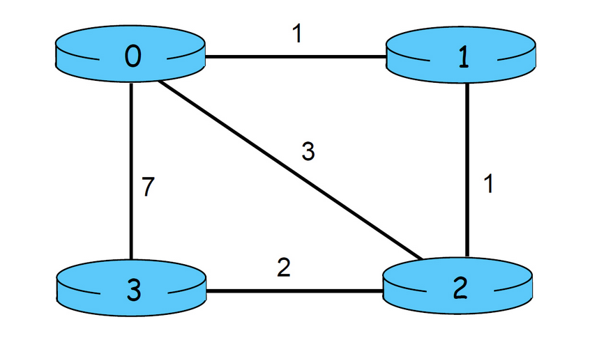

# Distance Vector Routing

### Purpose

Simulates asynchronous distance vector routing for the following network:



The full details of the project can be found [here.](https://gaia.cs.umass.edu/kurose_ross/programming/DV/Programming%20Assignment%201.html)
### Usage

The Makefile compiles all the source files at once, which you can immediately test:
```bash
$ make && ./program.out
TRACE: 2
...
```

A higher TRACE requests more verbose logging.

### Specification

Uses the Bellman-Ford algorithm to optimize the distance tables.

- `distance_vector.c` launches the simuation
- `network.h` provides utility functions and handles prototyping
- `nodeX.c` (0-3) initializes the distance table with `rtinitX` and processes neighbor updates with `rtupdateX`

Link cost changing and the "Count to Infinity" problem are handled by requesting all nodes to rebuild their distance tables. A more efficient but complex solution would be [Poison Reverse](https://www.geeksforgeeks.org/what-is-poison-reverse-in-networking/) implemented by [jsevilla274](https://github.com/jsevilla274/distancevector)

NOTE: The boilerplate code from Dr. Kurose was refactored to fix warnings and follow modern C style conventions.